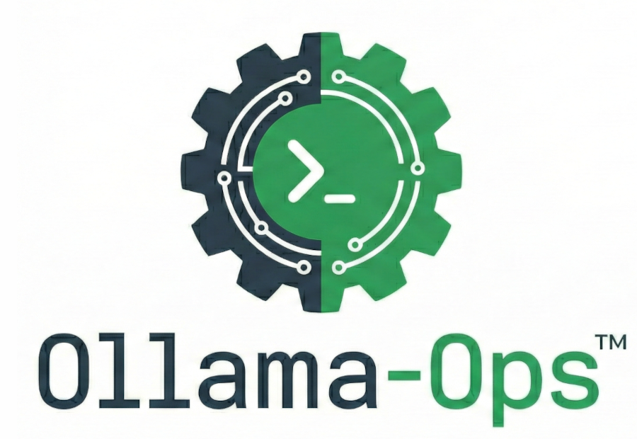

# Ollama Ops

<div align="center">
  
</div>

A robust Python utility for managing, monitoring, auto-optimizing, and cleaning local Ollama models.

**Disclaimer:** This project is powered by Ollama but is an independent utility. It is not created, affiliated with, or endorsed by the Ollama team.

## Why this exists

Ollama is fantastic for running local AI, but advanced users may hit friction points that slow down development. **Ollama Ops** was built to solve these specific workflow bottlenecks:

### 1. The "Modelfile" Tedium

While you can adjust context size globally with `OLLAMA_CONTEXT_LENGTH` or temporarily via `/set parameter num_ctx`, these methods lack persistence. Creating permanent, optimized model versions usually requires manually writing a Modelfile and running creation commands.

* **The Fix:** Ollama Ops automates this entirely. It generates the file and builds the persistent model in one command, enabling the specific benefits (API compatibility, naming conventions) detailed below.

### 2. Identifying Modified Models

When you have five versions of Llama 3 with different context lengths, it gets confusing fast.

* **The Fix:** This tool enforces a consistent naming convention (e.g., `llama3-ctx32k`), so you can instantly spot a model's capacity just by looking at the list.

### 3. The "VRAM Shuffle" (ComfyUI / vLLM Interop)

You likely use other GPU tools like **ComfyUI**, **vLLM**, or **PyTorch**. If Ollama is hoarding VRAM, those tools will crash.

* **The Fix:** Ollama Ops provides a scriptable "Panic Button" (`stop`) to instantly flush VRAM without killing the Ollama service, and a `load` command to restore your state later.

### 4. Better Inventory Control

* **Sorting:** Native Ollama only lists models by install date. Ollama Ops lets you sort by **Alphabetical** order (to find names) or **Size** (to find space hogs).
* **Cleanup:** Native Ollama requires you to delete models one by one. Ollama Ops brings standard shell-like **wildcard support** (e.g., `rm "*-ctx*"`) to your model management.

### 5. Context Amnesia & The Need for "Baked" Variants

Default models ship with conservative context limits (usually 4k or 8k tokens) regardless of your GPU's power.

* **The Fix:** The "Physics First" optimizer calculates the exact maximum context that fits your specific GPU, creating a custom variant that maximizes memory usage without crashing.

---

## FAQ: Why can't I just set the context size in my client settings?

Often, the answer is **no**. Here is why you need permanently "baked" model variants (e.g., `llama3-ctx32k`):

### The OpenAI API Compatibility Gap

Many modern tools (Autogen, CrewAI, certain VS Code extensions) connect to Ollama using the **OpenAI-compatible API**. The standard OpenAI protocol **does not** have a parameter for context window size (`num_ctx`).

* *The Problem:* If you connect a standard OpenAI client to Ollama, it usually defaults to the model's base config (often just 2k or 8k), even if your GPU can handle 100k.
* *The Fix:* By creating a model named `qwen-ctx32k` where the size is hard-coded in the Modelfile, you force the API to use that size simply by selecting that model name.

### "Dumb" Client Applications

Many GUI wrappers and coding assistants have rigid settings.

* *Global Limits:* They might apply a single context limit (e.g., 4096) to *all* models, crippling your large models and crashing your small ones.
* *Hidden Settings:* Some apps simply don't expose the setting at all.
* *The Fix:* You can generate a "Goldilocks" variant for every model you own that perfectly fills your specific VRAM, then just select that model in your app.

### Performance vs. Amnesia

* *Too Small:* The model "forgets" the beginning of your conversation or code file.
* *Too Big:* Allocating 128k context on a model that only fits 32k in your GPU will push layers to system RAM (CPU). This kills generation speed (tokens/sec) instantly.
* *Just Right:* This tool calculates the exact maximum that fits in VRAM, giving you the smartest possible model that still runs at full GPU speed.

## Key Features

* **Auto-Optimization:** Calculates exactly how many tokens fit in your remaining VRAM and creates a custom model variant.
* **Batch Cleanup:** Safely delete groups of models using wildcards with an interactive confirmation safety catch.
* **The "Panic Button":** Instantly unload all models to free up VRAM for other tasks without restarting the Ollama service.
* **Warmup Scripts:** Pre-load specific models into VRAM to eliminate "cold start" latency.
* **Better Inventory:** Sort models by Size or Name.
* **Automation Ready:** Supports JSON input/output for integration with other tools.

## Requirements

* **OS:** Linux or Windows (WSL2 recommended for Windows).
* **Python:** 3.8+
* **Ollama:** Must be installed and running (`ollama serve`).
* **Hardware:** An NVIDIA GPU with valid drivers (requires `nvidia-smi` on PATH) is **required** for the optimize feature.

  * *Note: Management features (`stop` / `list` / `load` / `rm`) work on any hardware.*

## Installation & Setup

### Recommended: Install as System Command

This allows you to type `ollama-ops` from anywhere in your terminal.

1. **Rename the script**

   You must rename `ollama-ops.py` to `ollama_ops.py` (replace the hyphen with an underscore).

2. **Install with pip**

   Run this command in the project directory:

   ```bash
   pip install -e .
   ```

3. **Verify**

   You can now run commands like `ollama-ops list` from any directory.

### Note on Naming Conventions

You may notice a discrepancy between the command name and the file name. This is intentional:

* **The Command (`ollama-ops`):** We use a hyphenated name to clearly distinguish this project as an independent utility *for* Ollama, complying with trademark guidelines to avoid confusion with official Ollama products.
* **The Module (`ollama_ops`):** We use an underscore internally because Python module names cannot contain hyphens (syntax limitation).

### Alternative: Run Directly

If you prefer not to install it globally, you can run the script using the Python interpreter.

* *Note:* Replace `ollama-ops` in the examples below with `python ollama-ops.py`.

## Usage (CLI)

### 1. Optimize Context (The Killer Feature)

Auto-calculates max context and creates a new model variant.

```bash
# Batch optimize ALL models with a 1.5GB safety buffer
ollama-ops optimize all --buffer 1.5

# Optimize a specific family (supports wildcards)
ollama-ops optimize "qwen*" --buffer 1.0

# Force manual metadata entry (if automation fails)
ollama-ops optimize my-custom-model --manual
```

### 2. Manage Resources

```bash
# Stop all running models (Free VRAM immediately)
ollama-ops stop

# List models sorted by size (largest first)
ollama-ops list --sort size --desc

# Show currently loaded models and VRAM usage
ollama-ops running

# Clean up / Delete models (Wildcards supported)
ollama-ops rm "*-ctx*"      # Prompts for confirmation
ollama-ops rm "unused-*" -y # Force delete (no confirmation)
```

### 3. Automation Helpers

Great for startup scripts or cron jobs.

```bash
# Stop models and output list to JSON
ollama-ops stop --json > session.json

# Restore models from file
ollama-ops load --file session.json

# Load specific models from inline JSON
ollama-ops load --models '["llama3", "mistral"]'
```

## Usage (Python Library)

You can import `ollama_ops` into your own Python scripts.
You must rename `ollama-ops.py` to `ollama_ops.py` (replace the hyphen with an underscore).

```python
import ollama_ops

# 1. Check VRAM programmatically
free_bytes = ollama_ops.get_gpu_free_memory()

# 2. Clean environment before a heavy task
if free_bytes < (10 * 1024**3):
    ollama_ops.stop_models()

# 3. Ensure your daily drivers are hot-loaded
ollama_ops.load_models(["llama3:latest", "codellama:13b"])
```

## How Optimization Works

1. **Metadata Check:** Tries to get architecture (Layers, Heads, Embed Dim) from the Ollama API.
2. **CLI Scraping:** If API fails, it scrapes `ollama show` output.
3. **Static Calculation:** If metadata exists, it calculates max context using the GQA formula.
4. **Benchmark:** If metadata is missing, it loads the model at 2k and 8k context to measure the actual VRAM delta ("Physics First").
5. **Heuristic Fallback:** If all else fails, it estimates architecture based on parameter count (e.g., 8B params = Llama 3 architecture) and adds a +1.0 GB safety buffer.

## License

MIT License. See `LICENSE` for details.

## Disclaimer on Hardware Use

This tool interacts with hardware drivers and memory allocation. While it includes safety buffers, pushing hardware to its limit always carries a risk of instability or OOM errors. Use at your own risk.
